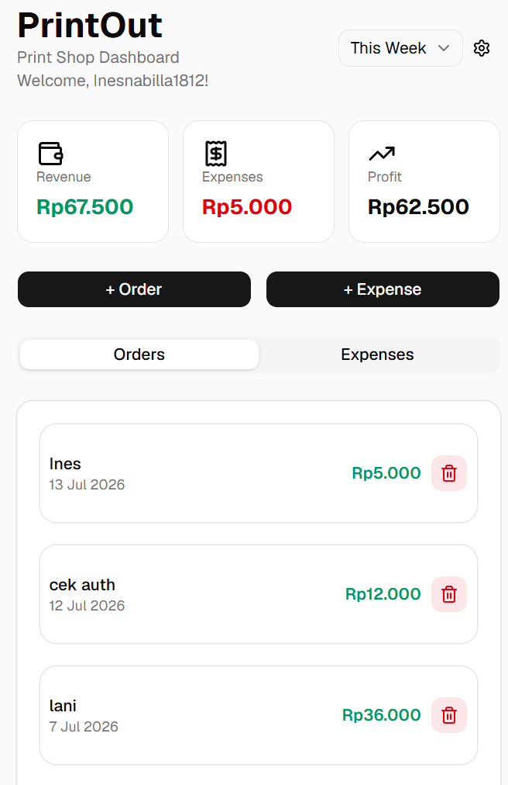
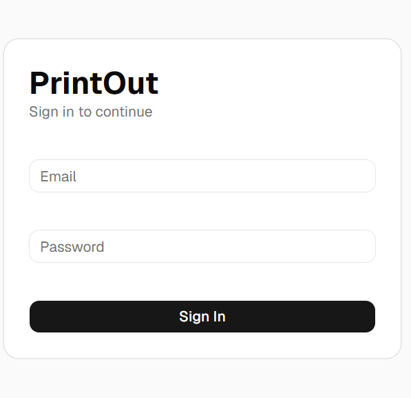
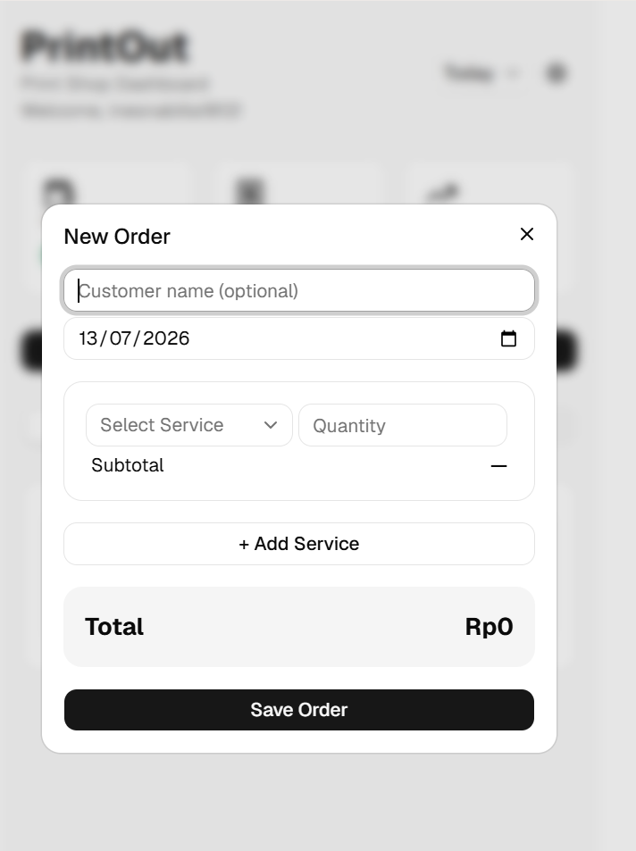
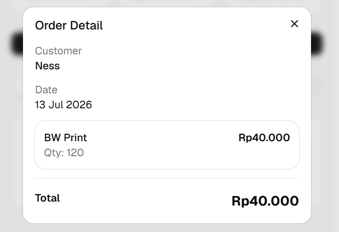
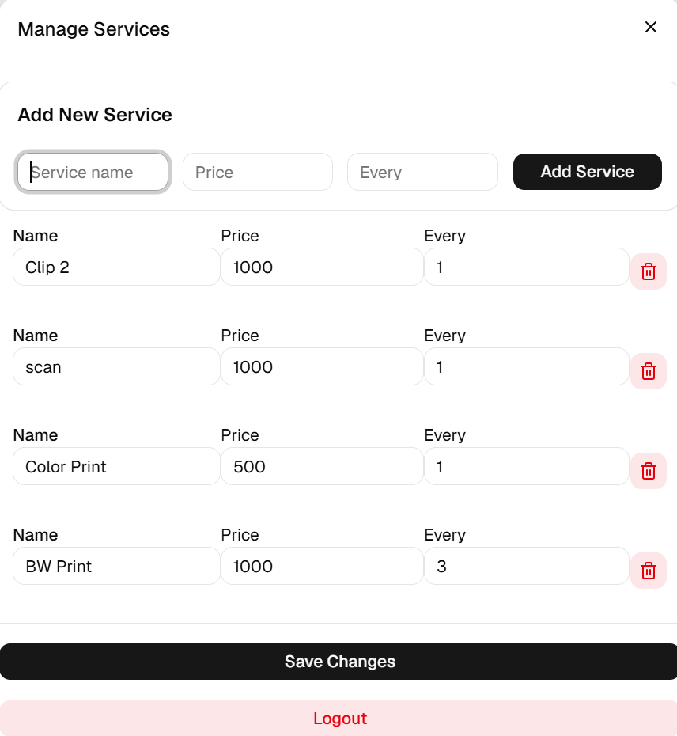
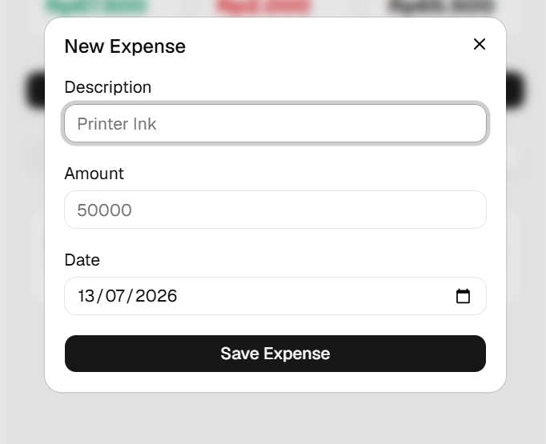

# PrintOut

A modern dashboard for small print shops to manage orders, services, expenses, and profit in one place.

Built with React, TypeScript, Tailwind CSS, shadcn/ui, and Supabase.

## Live Demo: https://print-out.vercel.app/

## Preview



## Features

- Authentication with Supabase
- Dashboard summary
- Revenue, Expenses & Profit
- Order management
- Multiple services per order
- Expense tracking
- Service management
- Order detail dialog
- Period filtering
- Responsive design

## Tech Stack

- React
- TypeScript
- Vite
- Tailwind CSS
- shadcn/ui
- Supabase

## Database

orders

order_items

services

expenses

Supabase Authentication

Row Level Security (RLS)

## Installation

```bash
git clone <repo>

npm install

npm run dev


---

## Environment Variables

```md
## Environment Variables

Create a `.env` file:

```env
VITE_SUPABASE_URL=YOUR_URL
VITE_SUPABASE_ANON_KEY=YOUR_KEY
```

---

## Screenshots








## Future Improvements

- Export reports to PDF
- Customer management
- Analytics dashboard
- Inventory tracking
- Dark mode

## Architecture

Frontend
- React
- TypeScript
- Tailwind CSS
- shadcn/ui

Backend
- Supabase
- Authentication
- Row Level Security (RLS)

Database
- orders
- order_items
- services
- expenses
